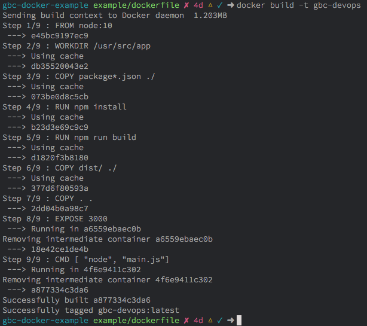
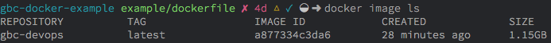
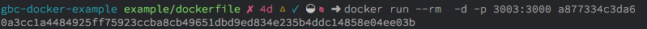
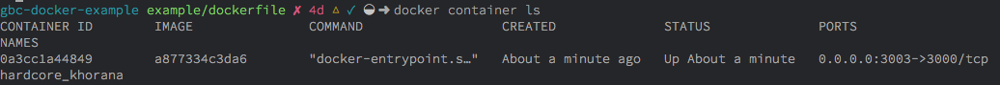
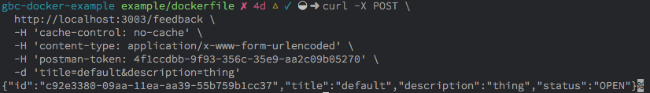
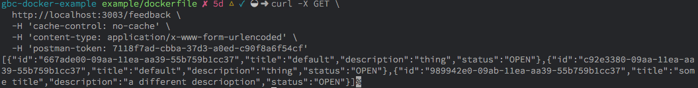

# GBC DevOps Docker Exercise

*You'll be launching a new instance for this challenge so ensure you update your server and install git. Commands can be found below for reference.*

```sh
#Perform a quick update on your instance:
sudo yum update -y

#Install git in your EC2 instance
sudo yum install git -y

#Install Docker
sudo yum install -y docker

#Add the ec2-user to the docker group for elevated permissions
sudo usermod -aG docker ec2-user

#Start the docker service
sudo service docker start
```

#### Instructions

To create an image from the Dockerfile found in [our example project](https://github.com/jayoharedee/rateme-backend), first start by cloning [the project](https://github.com/jayoharedee/rateme-backend) on your EC2. **Make sure you checkout the branch `example/dockerfile` before continuing.**

Once you're on the example/dockerfile branch, we're going to run a series of commands in the root of the clone repository.

```sh
$ sudo docker image ls
# Output should be:
# CONTAINER ID        IMAGE               COMMAND             CREATED             STATUS              PORTS               NAMES
$ sudo docker build -t gbc-devops .
```

**For security reasons, we need to run commands with elevated privileges on our EC2. When running commands with elevated permissions we use the `sudo` command. The screengrabs below were completed on macOS and my configuration is much different than default EC2 settings. Due to this, make sure you use sudo when running docker commands on your EC2**

After building a docker container we should see an output that looks something like the image thats found below. My output might look a little different than yours as I've build this container before and Docker leveraged a caching layer containing artifacts that helped produce a faster build. This is one advantage of Docker, you'll only see a reduced performance tax for a lot of the work that needs to be completed by the engine.



If we run `docker container ls` one more time, we should see something a little different than we did before. We can now see that by running the build command (`docker build -t gbc-devops .`) in the directory where a `Dockerfile` is found, it produced an image for us. Previously when we ran `docker image ls` we saw nothing but table headers. We now have a row containing details on our image. The ID and Repository columns can be utilized for reference when working with the image. Tag is the images version, created and size columsn speak for themselves.



That's great but, what the f!*@'s an image? Well, I'm glad you asked. Remember before when I mentioned faster builds because of cache? That's one task that a docker image helps us out with amongst many other things. Images have layers to them and each layer of a Docker image handles different things. Some layers deal with system adminstrative stuff like handling disk size. If you want to learn more about Docker images, have a look at the [docs](https://docs.docker.com/engine/reference/commandline/images/) for more insights along with useful commands.

When we use the image subset of the docker commands, it allows us to perform operations with the image. Like running it.

To run an image, we use the `docker run` command. This command subset allows us to interact with the images quite intimately. A lot can be done with docker run and to get the full picture, again check out the [documentation](https://docs.docker.com/engine/reference/run/) for a more comprehensive overview of how the command is used.

We're going to be using the docker run command to reference the gbc-devops image we built, set some best practices, and then we'll expose some ports so we our host machine can interact with the API running inside the container.



```sh
$ sudo docker run --rm  -d -p 3003:3000 a877334c3da6
```

Let's dissect the above command a bit. After the run argument, we notice some flags and switches. Let's see what each one of these additional parameters do:

* --rm : this is an optimization tweak when running the container. For this specific project we're only working with ephemeral data and it's not a service we want running in the background. --rm ensures that when we exit, the container stops.
* -d : this allows the container to run in detached mode. This means that the container is running in the background and won't display container information in our current terminal session unless we explicitly ask for it.
* -p : a crucial component here as this is where we define our ports. In the command I've designated port 3003 on our host machine to link to port 3000 of our container. I only did this for demonstration purposes but it's conventional to mirror the port numbers. So in an ideal world, it would look like 3000:3000 instead of 3003:3000
* the last argument is the id of our image. this tells docker to run the image we built at the beginning of the lab using the `docker build -t gbc-devops .` command in the project directory which contains our docker file.

Ruinning `docker container ls` now, should show us a container is up and running. Let's see what that looks like.



In the above image, we see that we now indeed have a container running. Again, we have some tabular data that provides some insights on our container. We can see the name is just the ID of our container, this is because we used the ID. Take a look at the last column that says NAMES. In that column the value `hardcore_khorana` has been inserted. This name was generated by default through docker for us to reference our container by name. 

If we look at the ports column, we can see that indeed we have our localhost hooked up to port 3000 on our container. I've included a screengrab for clarity. Remember, before the colon is our local machine, the "host" machine. What proceeds the colon is the port which our API is running on inside the docker container, port 3000.

Let's try communicating with port 3003 on our local machine and see what kind of responses we can get back. How are we going to do this? Well, we could use something like Postman or Insomnia to interact with HTTP but we're going to use cURL instead :)

```sh
curl -X POST \
  http://localhost:3003/feedback \
  -H 'cache-control: no-cache' \
  -H 'content-type: application/x-www-form-urlencoded' \
  -H 'postman-token: 4f1ccdbb-9f93-356c-35e9-aa2c09b05270' \
  -d 'title=default&description=thing'
```

Pasting the above command in our shell should return a JSON payload as we made a POST request with some parameters. We've created a piece of feedback. Notice the last switch, it has a -d and a string which follows: `'title=default&description=thing'`. These are new values we're POSTing to the feedback endpoint.

After exefcuting the cURL command, we should seem something like the following. Notice the JSON object at the bottom of the image.



How can we be sure that something actually happened though? If we've used cURL to interface with the API our container is serving on port 3003 of our local machine, that means anything we've posted, we should get back in theory, so long no authentication is needed or the endpoint is not protected.

```sh
curl -X GET \
  http://localhost:3003/feedback \
  -H 'cache-control: no-cache' \
  -H 'content-type: application/x-www-form-urlencoded' \
  -H 'postman-token: 7118f7ad-cbba-37d3-a0ed-c90f8a6f54cf'
```

Above we perform a GET command with cURL to get a response from our container which is running our API, exposed on port 3000 in the container, but port 3003 on our local machine. Notice the URI, the port is 3003 not 3000.

After making that GET request to our RESTful endpoint, we should see a response like so.




# Documentation for the node framework used to create the feedback API

<p align="center">
  <a href="http://nestjs.com/" target="blank"></a>
</p>

[travis-image]: https://api.travis-ci.org/nestjs/nest.svg?branch=master
[travis-url]: https://travis-ci.org/nestjs/nest
[linux-image]: https://img.shields.io/travis/nestjs/nest/master.svg?label=linux
[linux-url]: https://travis-ci.org/nestjs/nest
  
  <p align="center">A progressive <a href="http://nodejs.org" target="blank">Node.js</a> framework for building efficient and scalable server-side applications, heavily inspired by <a href="https://angular.io" target="blank">Angular</a>.</p>
    <p align="center">
<a href="https://www.npmjs.com/~nestjscore"></a>
<a href="https://www.npmjs.com/~nestjscore"></a>
<a href="https://www.npmjs.com/~nestjscore"></a>
<a href="https://travis-ci.org/nestjs/nest"></a>
<a href="https://travis-ci.org/nestjs/nest"></a>
<a href="https://coveralls.io/github/nestjs/nest?branch=master"></a>
<a href="https://gitter.im/nestjs/nestjs?utm_source=badge&utm_medium=badge&utm_campaign=pr-badge&utm_content=body_badge"></a>
<a href="https://opencollective.com/nest#backer"></a>
<a href="https://opencollective.com/nest#sponsor"></a>
  <a href="https://paypal.me/kamilmysliwiec"></a>
  <a href="https://twitter.com/nestframework"></a>
</p>
  <!--[](https://opencollective.com/nest#backer)
  [](https://opencollective.com/nest#sponsor)-->

## Description

[Nest](https://github.com/nestjs/nest) framework TypeScript starter repository.

## Installation

```bash
$ npm install
```

## Running the app

```bash
# development
$ npm run start

# watch mode
$ npm run start:dev

# production mode
$ npm run start:prod
```

## Test

```bash
# unit tests
$ npm run test

# e2e tests
$ npm run test:e2e

# test coverage
$ npm run test:cov
```

## Support

Nest is an MIT-licensed open source project. It can grow thanks to the sponsors and support by the amazing backers. If you'd like to join them, please [read more here](https://docs.nestjs.com/support).

## Stay in touch

- Author - [Kamil Myśliwiec](https://kamilmysliwiec.com)
- Website - [https://nestjs.com](https://nestjs.com/)
- Twitter - [@nestframework](https://twitter.com/nestframework)

## License

  Nest is [MIT licensed](LICENSE).
